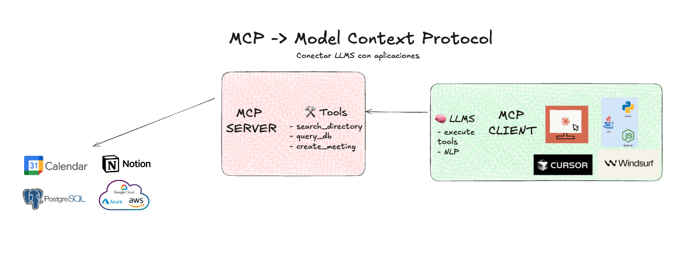
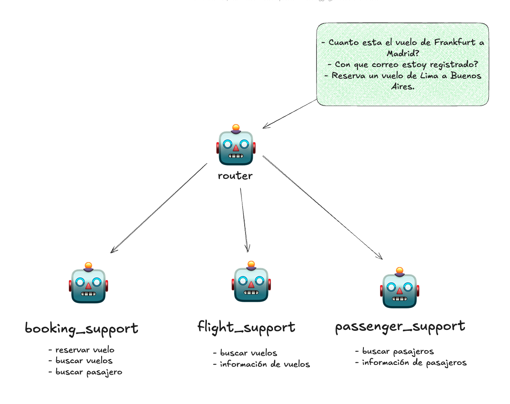

# Flight System

## Overview
This repository contains the flight management system with MCP (Model Context Protocol) integration.

## Project Structure
- `flight-app/`: Main flight application
- `flight-mcp-client/`: MCP client implementation
- `flight-mcp-server/`: MCP server implementation

## MCP

```markdown

```

## Agentic Workflow

```markdown

```